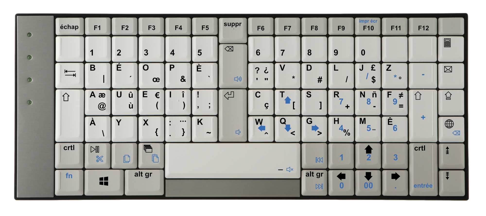

# béop programmation
Disposition de clavier ergonomique pour windows inspirée de bépo, visant à faciliter la programmation sur TypeMatrix 2030.

## Utilisation
Le clavier de l'ordinateur sur lequel le TypeMatrix est branché doit être configuré en QWERTY Anglais (États-Unis).

Afin d'avoir un *AltGr* symétrique, il faut créer un mapping de *Right Alt* vers *Left Alt* sur [SharpKeys](https://www.randyrants.com/category/sharpkeys/), puis redémarrer l'ordinateur.

Il suffit ensuite de lancer [beop_programmation.exe](https://github.com/tim99oth99e/beop-programmation-windows/blob/master/beop_programmation.exe).

## Informations

L'exécutable est un script AutoHotkey compilé.

Cette disposition de clavier s'inspire des dispositions [Bépo](http://bepo.fr), [Béop](http://beop.free.fr) et [Programmer Beop](https://linuxfr.org/users/luxcem/journaux/programmer-beop).
